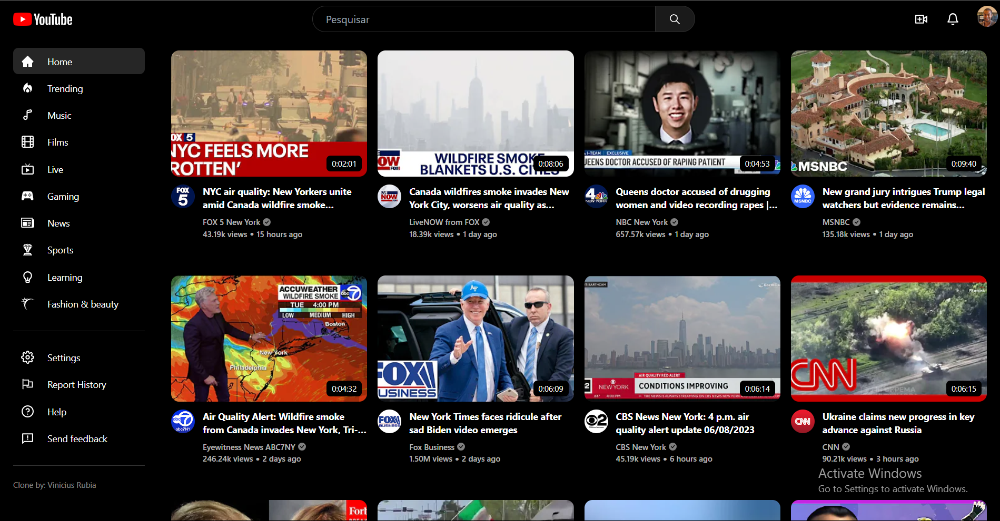
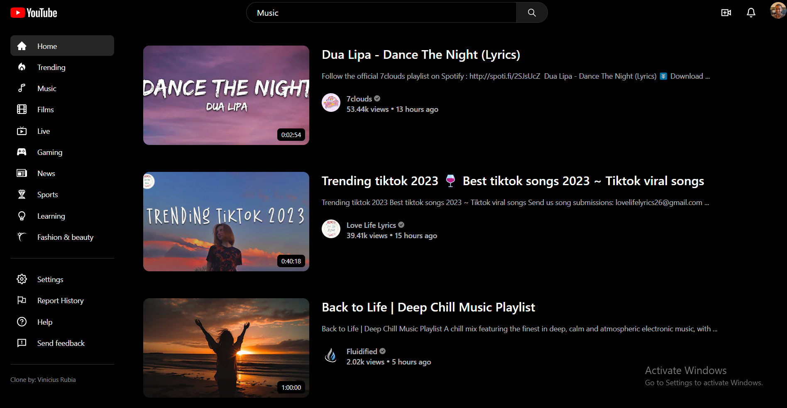
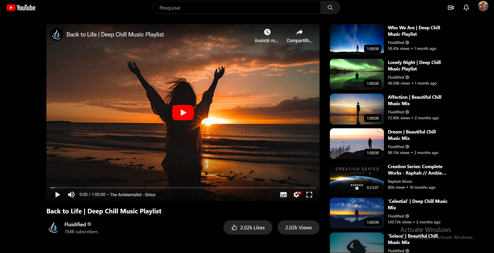
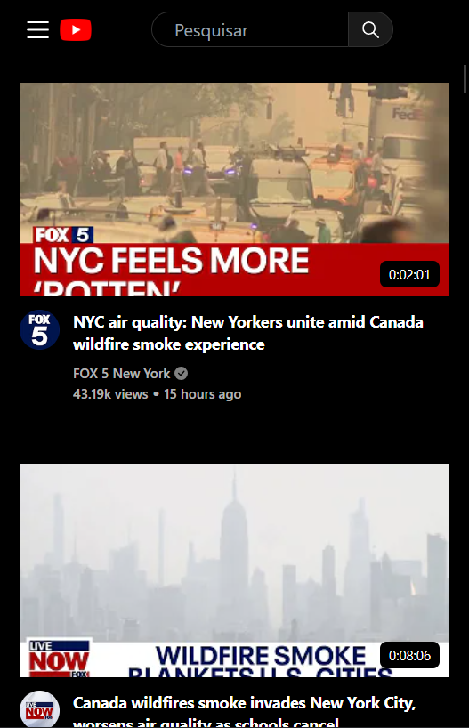
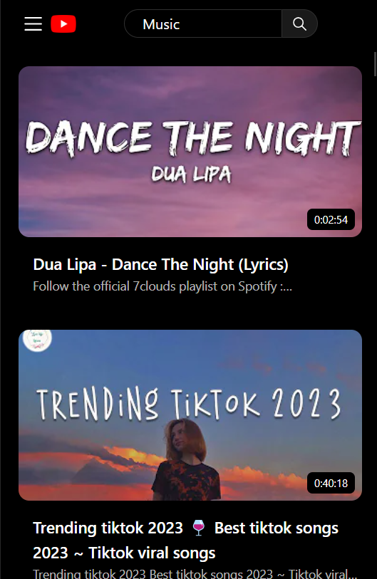
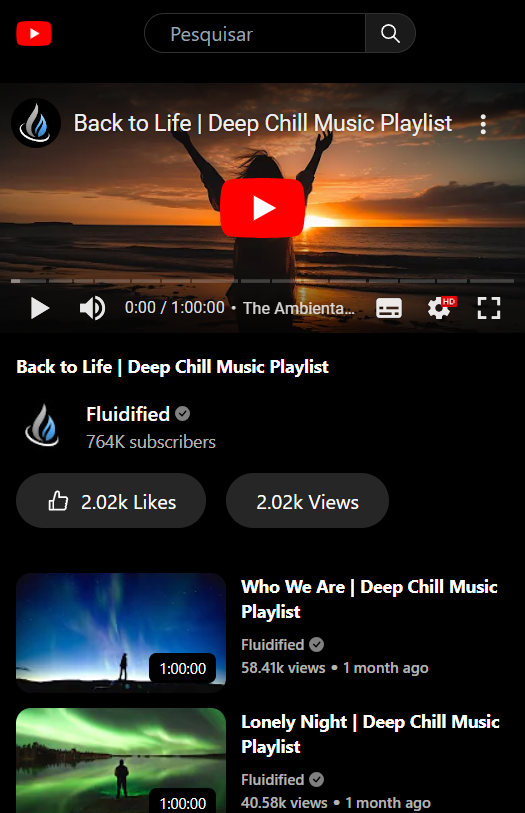

# Clone do YouTube

Uma aplicação web que replica as funcionalidades básicas do YouTube, desenvolvida utilizando Vite como ferramenta de construção. Este projeto permite que os usuários naveguem por uma ampla variedade de vídeos, realizem pesquisas por termos-chave e reproduzam conteúdo de vídeo diretamente na plataforma.

## Visão Geral:

O Clone do YouTube é uma aplicação completa que oferece uma experiência de usuário semelhante ao popular site de compartilhamento de vídeos. Ele apresenta uma interface intuitiva e elegante, projetada com o auxílio do framework TailwindCSS para garantir um design moderno e responsivo em diferentes dispositivos.

Através da integração com a API do YouTube disponível no RapidAPI, o Clone do YouTube é capaz de obter dados atualizados sobre vídeos populares. Esses dados são exibidos de forma organizada e agradável aos usuários, proporcionando uma experiência de navegação fluida e agradável.

Além disso, o Clone do YouTube oferece a funcionalidade de pesquisa, permitindo que os usuários encontrem vídeos com base em palavras-chaves. Os resultados da pesquisa são apresentados de forma clara, facilitando a localização do conteúdo desejado.

Quando se trata de reprodução de vídeo, o Clone do YouTube utiliza a biblioteca React Player para exibir os vídeos selecionados diretamente na página. Os usuários podem assistir aos vídeos, controlar o progresso da reprodução, ajustar o volume e alternar para o modo de tela cheia, proporcionando uma experiência imersiva e interativa, mas claro, alguns vídeos fica indisponível por conta da api ser gratuita e não ter tanto suporte e segurança disponível para apresentar o conteúdo.
___

Você pode ver mais sobre o projeto neste link: [Clone Youtube](https://clone-youtube-rapdiapi.vercel.app/)

## 👀 Demonstração:

- 💻 Layout - Desktop
  |Feed|Search Video|Watch Video|
  |---|---|---|
  | |  |   

- 📱 Layout - Mobile
  |Feed|Search Video|Watch Video|
  |---|---|---|
  | |  | 

## 👉🏻 Funcionalidades 👈🏻

- Exibição de vídeos populares
- Pesquisa de vídeos por termos-chave
- Reprodução de vídeos
- Exibição de vídeos relacionados com o vídeo ativo no momento
- Opções de vídeos por categorias
- Design responsivo para desktop e dispositivos móveis

---

## 🧑‍💻 Tecnologias utilizadas:
- React
- Typescript
- TailwindCSS
- Axios
- React Icons
- React Router Dom
- React Player
- API - RapidAPI
---


## 🚀 Começando

Pra começar, primeiro clone o repositório do projeto pra sua máquina

```
$ git clone https://github.com/Vinicius-Rubia/Youtube-Clone.git
```

## ⚙️ Iniciando o Projeto

Para iniciar, execute os seguintes comandos em seu terminal:

```
$ cd Youtube-Clone -> Mudar para o diretório do projeto
```

```
$ npm install -> Instalar todas as dependências

ou então...

$ yarn -> Instalar todas as dependências
```

```
$ npm run dev -> Iniciar o projeto

ou então...

$ yarn run dev -> Iniciar o projeto
```

⌨️ com ❤️ por [Vinicius Rubia](https://github.com/Vinicius-Rubia) 😊
